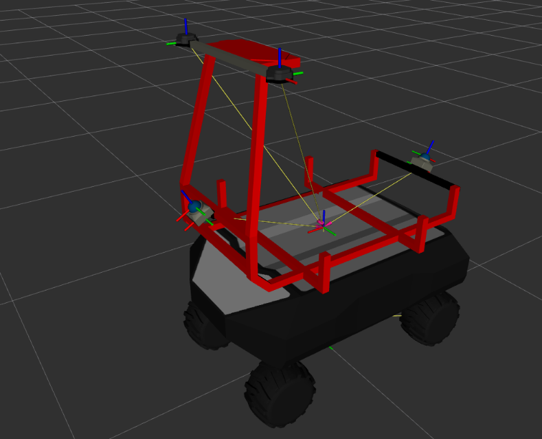
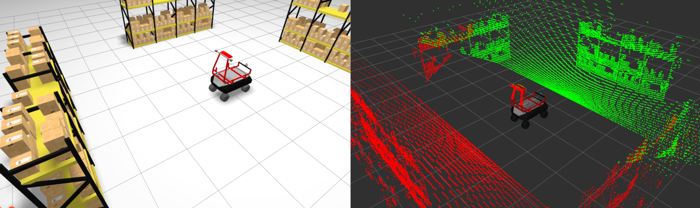

# robot_rbvogui_basket_layout_a

`robot_rbvogui_basket_layout_a` is an RB-VOGUI robot model with a basket and sensors. Start with the [robot_rbvogui_common README](../robot_rbvogui_common/README.md). It explains the mobile base and shared resources used here. This package adds the basket and sensor layout to that base.



## Resources

### Basket layout A model `urdf/model_basket_layout_a.xacro`

[`model_basket_layout_a.xacro`](urdf/model_basket_layout_a.xacro) is the Xacro entry point for the complete basket layout A model. It includes `robot_rbvogui_common/urdf/common.xacro` and adds the basket, two Livox Mid-360 3D lidars, and two u-blox antennas.

This package provides its own default configuration files. They are examples and guides that you can copy and adapt when creating another basket layout variant.

- [`config/default_xacro_args.yaml`](config/default_xacro_args.yaml) provides Xacro arguments for the common base, the basket, and the sensors. It includes sensor model options.
- [`config/default_simulation.yaml`](config/default_simulation.yaml) provides settings for the common base plugins and the sensor plugins. The NavSat simulations for the u-blox antennas are disabled by default.
- [`config/default_bridge.yaml`](config/default_bridge.yaml) defines the ROS 2 and Gazebo topics used by the base and the sensors.
- [`config/default_params.yaml`](config/default_params.yaml) configures the nodes launched for the model, including the bridge and kinematics.

### Reused resources from `robot_rbvogui_common`

The basket layout A model reuses the following resources from `robot_rbvogui_common`.

- The mobile base defined by `urdf/common.xacro`, including its chassis, battery, wheels, frames, and common Gazebo plugins.
- Common meshes, including the base meshes and the basket meshes used by this model.
- `launch/render_robot_urdf.launch.py`, which renders the basket layout Xacro into a URDF file.
- `launch/robot_state_publisher.launch.py`, `launch/bridge.launch.py`, and `launch/ground_vehicle_kinematics.launch.py`, which start the shared model nodes.
- `worlds/debug_world.sdf` and `worlds/debug_world_bridge.yaml`, which provide the simple Gazebo world used for inspection.

This package provides its own RViz configuration because its sensors differ from the base model and from other RB-VOGUI variants.

## Installation

`robot_rbvogui_basket_layout_a` depends on ROS 2 packages available from the APT package repositories. Install those dependencies with `rosdep`. It also depends on packages that are not available from APT. Their source repositories are listed in [`deps.repos`](deps.repos).

```bash
export WORKSPACE=<path-to-your-workspace>
mkdir -p "${WORKSPACE}"
git clone https://github.com/jfrascon/robot_rbvogui_basket_layout_a.git "${WORKSPACE}/robot_rbvogui_basket_layout_a"
vcs import "${WORKSPACE}" < "${WORKSPACE}/robot_rbvogui_basket_layout_a/deps.repos"
source /opt/ros/jazzy/setup.bash
rosdep install --from-paths "${WORKSPACE}" --ignore-src -r -y
```

## Build

Build the common package and the basket layout A package from the workspace root.

```bash
cd "${WORKSPACE}"
colcon build --merge-install --packages-select robot_rbvogui_common robot_rbvogui_basket_layout_a
source install/setup.bash
```

## Visualize the basket layout A model

The package includes a launch file and supporting resources to visualize the basket layout in Gazebo and RViz without adding it to a project. This visualization is illustrative only. It runs the model in the shared simple test world so that you can inspect it and receive test data from
the configured sensors.

The debug launch file is useful for quickly checking that the model still works after a change and for testing changes to the basket or sensors.

```bash
robot_rbvogui_basket_layout_a_share="$(ros2 pkg prefix robot_rbvogui_basket_layout_a)/share/robot_rbvogui_basket_layout_a"
"${robot_rbvogui_basket_layout_a_share}/scripts/debug_model_basket_layout_a.sh"
```

You can pass the script any argument accepted by `debug_model_basket_layout_a.launch.py`. To see the available arguments, run:

```bash
ros2 launch robot_rbvogui_basket_layout_a debug_model_basket_layout_a.launch.py --show-args
```

For example, run the simulation without the Gazebo GUI or RViz:

```bash
robot_rbvogui_basket_layout_a_share="$(ros2 pkg prefix robot_rbvogui_basket_layout_a)/share/robot_rbvogui_basket_layout_a"
"${robot_rbvogui_basket_layout_a_share}/scripts/debug_model_basket_layout_a.sh" \
  rviz_enabled:=False \
  gzgui_enabled:=False
```



## Tests

Build and run the common and basket layout A package tests from the workspace root.

```bash
cd "${WORKSPACE}"
colcon build --merge-install --packages-select robot_rbvogui_common robot_rbvogui_basket_layout_a
colcon test --merge-install --packages-select robot_rbvogui_common robot_rbvogui_basket_layout_a
colcon test-result --test-result-base build --verbose
```

### Inspect the generated URDF

You can also render the basket layout A model and validate the resulting URDF directly with `check_urdf`.

```bash
robot_rbvogui_basket_layout_a_share="$(ros2 pkg prefix robot_rbvogui_basket_layout_a)/share/robot_rbvogui_basket_layout_a"
ros2 launch robot_rbvogui_common render_robot_urdf.launch.py \
  robot_name:=rbv0 \
  robot_xacro_file:="${robot_rbvogui_basket_layout_a_share}/urdf/model_basket_layout_a.xacro" \
  robot_xacro_args_file:="${robot_rbvogui_basket_layout_a_share}/config/default_xacro_args.yaml" \
  robot_sim_file:="${robot_rbvogui_basket_layout_a_share}/config/default_simulation.yaml" \
  robot_urdf_file:=/tmp/rbvogui_basket_layout_a.urdf
check_urdf /tmp/rbvogui_basket_layout_a.urdf
```
